% Lebewohl Web Mercator
% Pirmin Kalberer @implgeo
% FOSSGIS 2025 Münster
---
width: 1600
height: 900
---

# Über mich

GIS-Entwickler @ Sourcepole, Schweiz

Web GIS, QGIS und andere OSGeo-Projekte

t-rex Tile-Server -> BBOX-Server

::: notes
OSM:
. . .
Lazy mapper (55 changesets in 15 years)
. . .
FOSSGIS e.V. board (German OSM chapter)
. . .
:::

# Web Mercator - "the bad parts"

## WARNUNG

Dieser Vortrag kann politische Aussagen enthalten!

## Grössenverzerrung

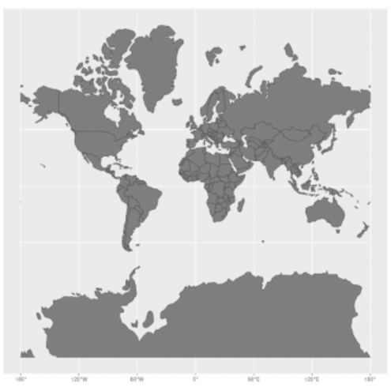

Afrika ist in Wirklichkeit 14-mal grösser als Grönland

::: notes
Image credit: https://en.wikipedia.org/wiki/Mercator_projection
:::

## Thematische Karten

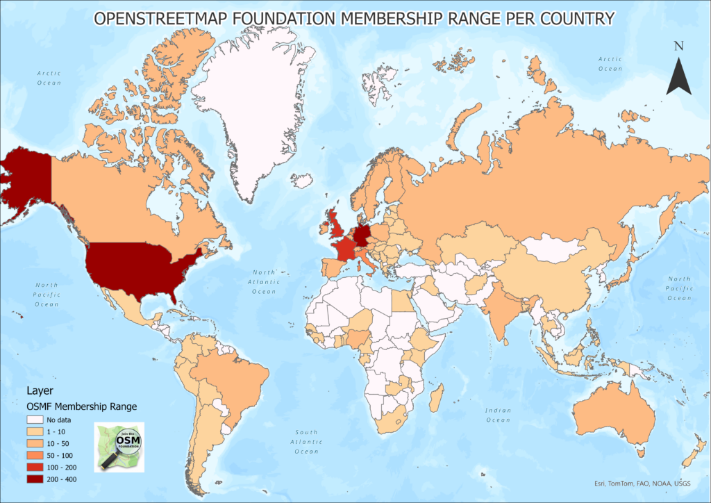

## In freier Wildbahn

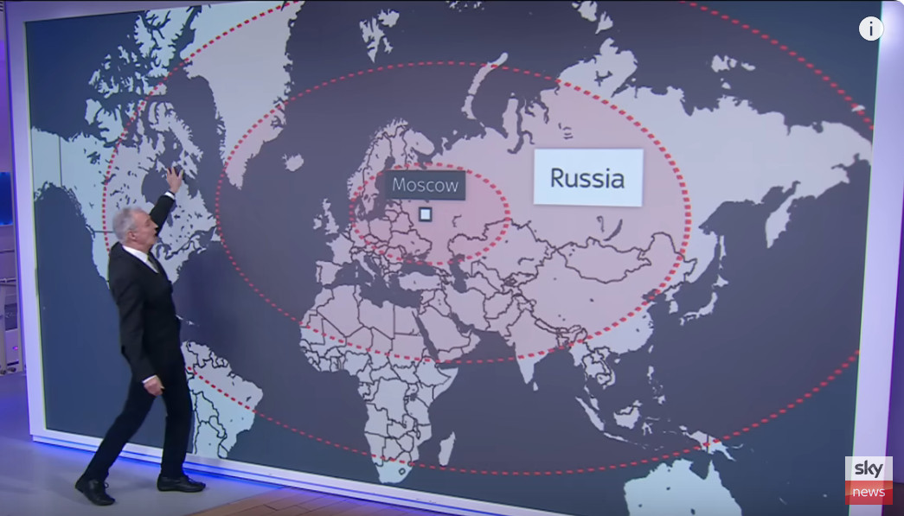

::: notes
On T-shirts, posters and even in school rooms
Image credit: https://mapstodon.space/@luis_de_sousa@mastodon.social/113540237357844184
:::

# Mercator projection

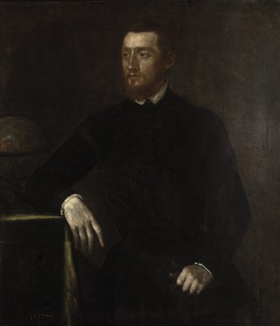

* Gerardus Mercator, 1569
* Winkeltreue zylindrische Kartenprojektion
* Gut für die Navigation

::: notes
* north everywhere "up" and south "down", while preserving local directions and shapes
* 1512 (Flanders) - 1594 (Duisburg)
<https://en.wikipedia.org/wiki/Gerardus_Mercator>
:::

## Web Mercator

* Mercator-Projektion beschnitten auf ~85°N bis 85°S
-> quadratisch, gut für Kacheln
* Mischung aus sphärischen und ellipsoidalen Formeln

::: notes
The value 85.051129° is the latitude at which the full projected map becomes a square
:::

# Alternativen

##

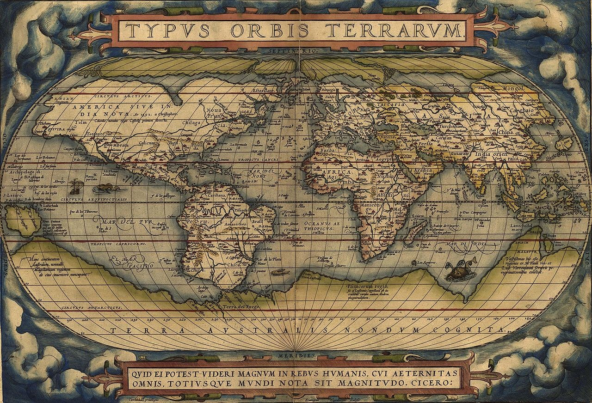

Theatrum Orbis Terrarum, 1572

::: notes
Cartographer Abraham Ortelius issues Theatrum Orbis Terrarum, the first modern atlas.

Three Latin editions of this (besides a Dutch, a French and a German edition) appeared before the end of 1572; 25 editions came out before Ortelius' death in 1598; and several others were published subsequently, for the atlas continued to be in demand till about 1612. It is often considered as the official beginning of the Golden Age of Netherlandish cartography (~1570s–1670s).
:::

##

::: notes
XKCD
:::

##

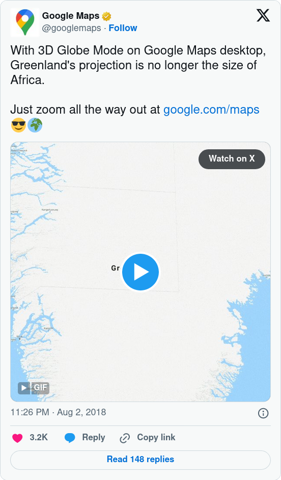

::: notes
2018
:::

##

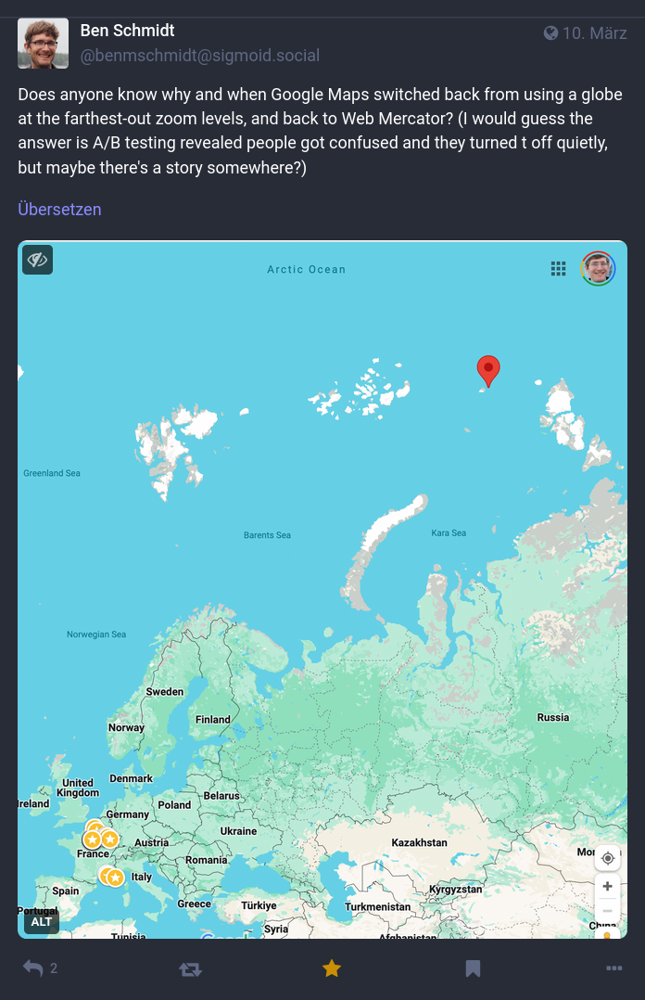

##

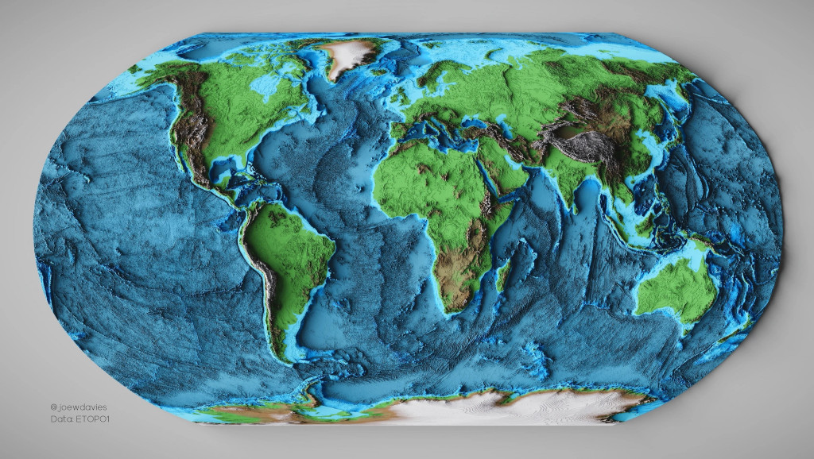

# Equal Earth Kartenprojektion

Bojan Šavrič, Tom Patterson, Bernhard Jenny, 2018

<https://www.equal-earth.com/>

::: notes
Inspired by the Robinson projection, retains the relative size of areas.
:::

## Equal Earth Greenwich

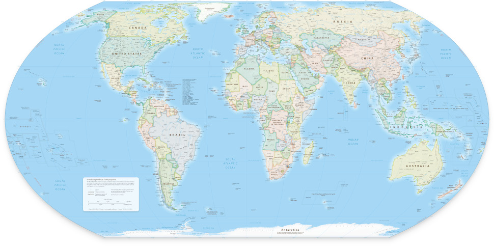

EPSG:8857

## Equal Earth Americas

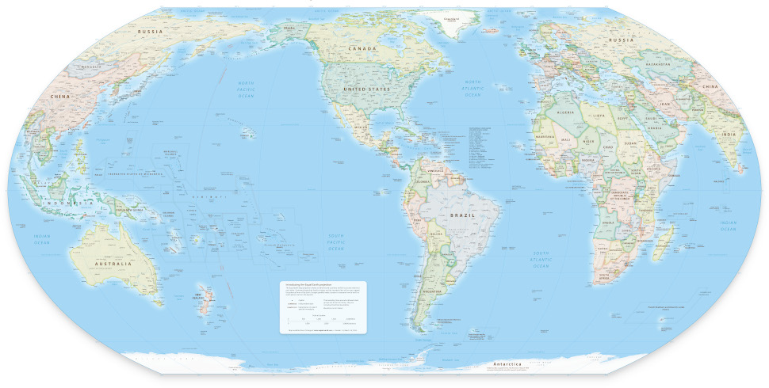

EPSG:8858

## Equal Earth Asia-Pacific

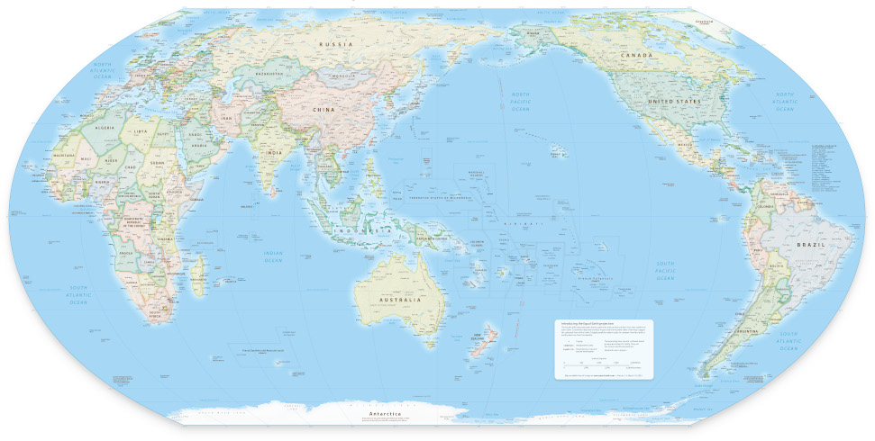

EPSG:8859

## Equal Earth Florence

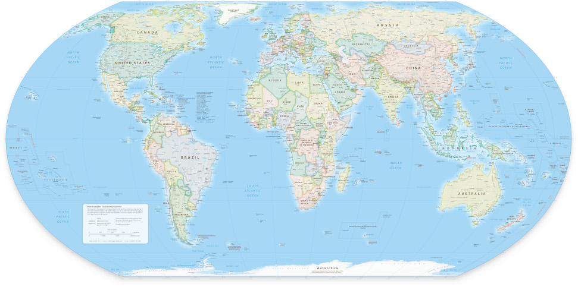

Florence Meridian 11E

## Unterstützung

* PROJ -> GDAL, QGIS, R
* D3, Plotly
* proj4js

# Web-Kartographie

Equal Earth wird bereits
von Kartographen verwendet.

. . .

Einschränkungen:

* Begrenztes Zoomen
* Statischer Mittelmeridian
* Kachel-Schema

## Tile Grid

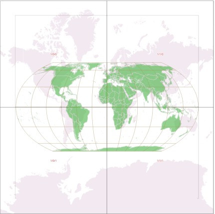

::: notes
A quadratic grid for Equal Earth centered on Greenwich is similar to a Web Mercator grid.
Instead of Mercator grid corners at +/-20'037'508 the grid corners of Equal Earth
Greenwich are at +/-17'243'959
:::

## Tile Grid skaliert

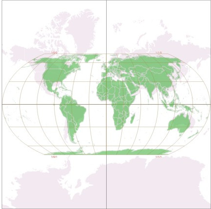

Skalierung auf Mercator-Breite.

::: notes
scale factor of 1.162. Conversions between geographic WGS84 coordinates and the map coordinate reference
system give wrong results without adapted calculations.
But maps can be displayed without any coordinate projection calculations.
:::

## MapLibre

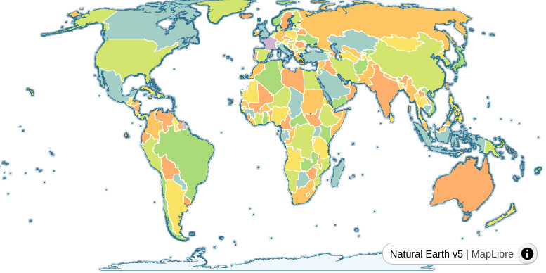

<https://equal.bbox.earth/maplibre/>

Web Mercator Tile Grid

## OpenLayers

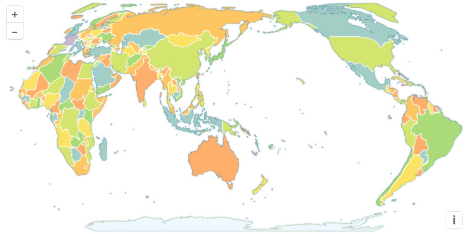

<https://equal.bbox.earth/ol-asia-pacific/>

Equal Earth Asia-Pacific, Web Mercator Tile Grid

## deck.gl

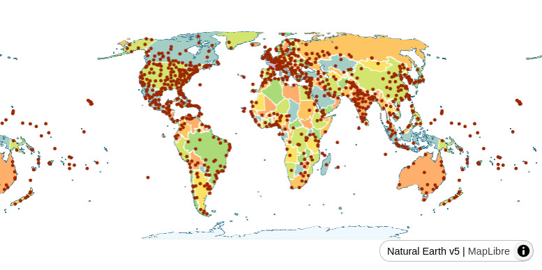

<https://equal.bbox.earth/deckgl/>

MapLibre-Karte mit deck.gl-Layer unter Verwendung des Web Mercator-Kachelgitters.

## Proposal: Kombinierte Projektionen

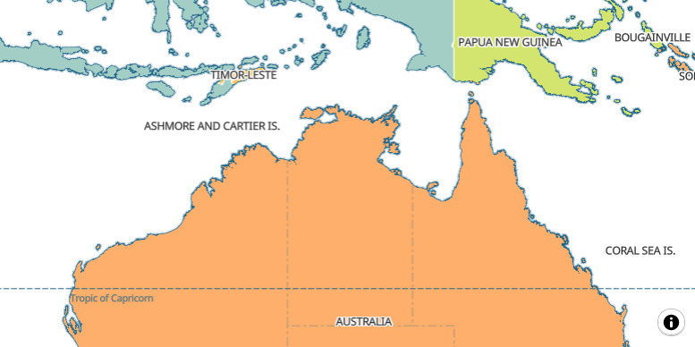

<https://equal.bbox.earth/maplibre-eq2merc/>

Equal Earth für z0-z2 und Web Mercator für z >= 3.

Kacheln für z0-z2 in geographischen Koordinaten (WGS84).

# Was ist schon vorhanden?

* Plugin für minimale Koordinatentransformationen für MapLibre
* Informationen und Code-Snippets: [equal.bbox.earth](https://equal.bbox.earth)

# Was fehlt noch?

## Animierter Übergang z2 -> z3

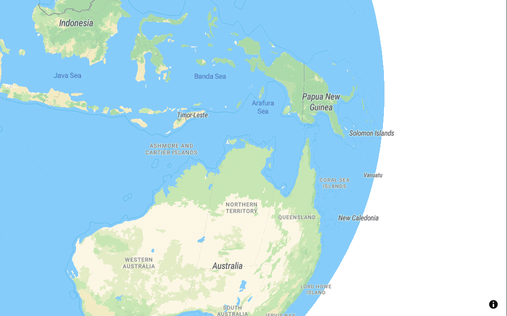

  <https://kvaleya.gitlab.io/maplibre/globe/globedemo.html>

## Dynamischer Mittelmeridian

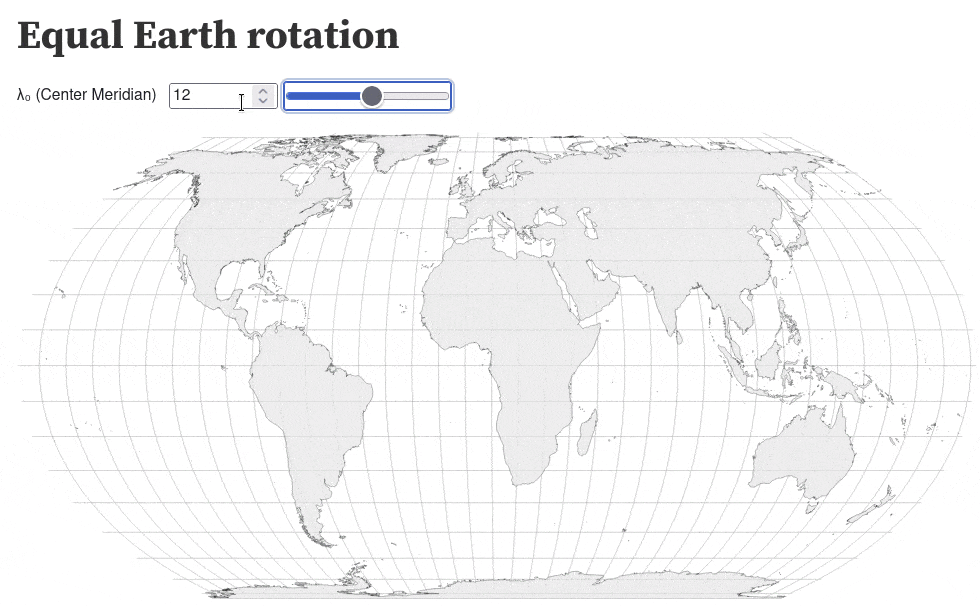

<https://observablehq.com/d/ece4d307c72c1312>

## Kernerweiterungen Viewer

### MapLibre: Projektionsunterstützung

### OpenLayer: Unterstützung für umprojizierte Vektor-Kacheln

Sponsoring gesucht!

# Fazit

Sag Lebewohl zu Web Mercator

(für Weltkarten)

und benutze Equal Earth.

::: notes
- Cartographic crime
- From now on, consider it officially forbidden
:::

# Danke

Pirmin Kalberer

[mapstodon.space/@implgeo](https://mapstodon.space/@implgeo)

[equal.bbox.earth](https://equal.bbox.earth)
