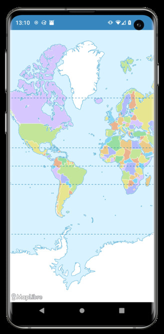
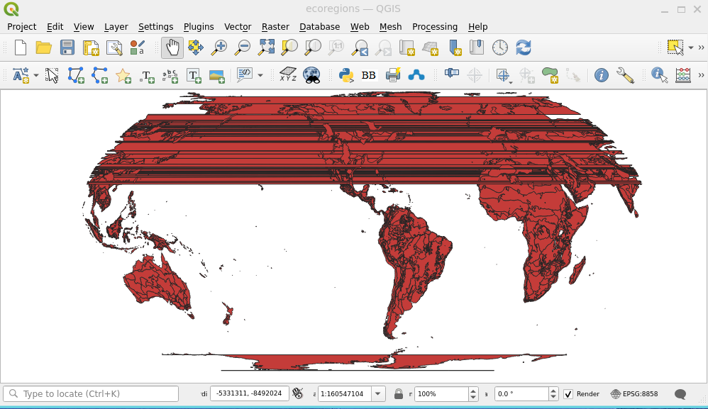

% Interactive web mapping with Equal Earth projection
% Pirmin Kalberer @implgeo
% FOSS4G 2026 Hiroshima
---
width: 1600
height: 900
---

# About me

GIS developer @ Sourcepole, Switzerland

Web GIS, QGIS and other OSGeo projects

t-rex tile server -> BBOX server

::: notes
OSM:
. . .
Lazy mapper (55 changesets in 15 years)
. . .
FOSSGIS e.V. board (German OSM chapter)
. . .
:::

# The current state of Web Mapping

. . .

* Web Mercator projection
* Sometimes a globe

# Web Mercator - the bad parts

## Size distortion

Africa actually has 14 times as much area as Greenland

::: notes
Image credit: https://en.wikipedia.org/wiki/Mercator_projection
:::

## Thematic mapping

## In the wild

::: notes
On T-shirts, posters and even in school rooms
Image credit: https://mapstodon.space/@luis_de_sousa@mastodon.social/113540237357844184
:::

# Mercator projection

* Gerardus Mercator, 1569
* Conformal cylindrical map projection
* Good for navigation

::: notes
* north everywhere "up" and south "down", while preserving local directions and shapes
* 1512 (Flanders) - 1594 (Duisburg)
<https://en.wikipedia.org/wiki/Gerardus_Mercator>
:::

## Web Mercator

* Mercator projection cropped to ~85°N to 85°S
  -> square, good for tiling
* Spherical and ellipsoidal mix of formulas

::: notes
The value 85.051129° is the latitude at which the full projected map becomes a square
:::

# Equal Earth map projection

Bojan Šavrič, Tom Patterson, Bernhard Jenny, 2018

<https://www.equal-earth.com/>

::: notes
Inspired by the Robinson projection, retains the relative size of areas.
:::

## Equal Earth Greenwich

EPSG:8857

## Equal Earth Americas

EPSG:8858

## Equal Earth Asia-Pacific

EPSG:8859

## Equal Earth Florence

Florence Meridian 11E

# Behaviour for interactive maps

Two proposals

## Dynamic center meridian

[Interactive example (OpenLayers)](https://openlayers.org/en/latest/examples/equal-earth-geojson.html)

::: notes

Reproject WGS-84-Tiles?

<https://observablehq.com/d/ece4d307c72c1312>
:::

## Use Mercator for higher zoom levels

* World view: Equal earth
* Regional view: Mercator

::: notes
<https://equal.bbox.earth/maplibre-eq2merc/>
:::

## Challenges: Antimeridian problems

Solutions:

* Prepare data (split at potential antimeridians)
* Improve rendering algorithms

## Smooth transition Equal Earth -> Mercator

Example: MapLibre globe

::: notes
<https://kvaleya.gitlab.io/maplibre/globe/globedemo.html>
:::

# Software support

## Projection

* PROJ -> GDAL, QGIS, R
* proj4js
* D3

## OpenLayers

* Projection support for raster and vector data
* Reprojection of vector tiles
* Support for non-Mercator grids

::: notes
Dynamic projection demo: https://ahocevar.net/fossgis-2026/14
:::

## MapLibre

* Single tile grid
* Globe view reprojected from Mercator tiles
* In development: Equal earth view reprojected from Mercator tiles!

::: notes

<https://equal.bbox.earth/maplibre/>
:::

## Ways to support Equal Earth

* Use data in Equal Earth projection
  * Which tile grids?
  * PoC SotM EU 2024: Equal Earth projected data in Mercator grid
* Reproject data from WGS84 (or Mercator?)

## How can you help?

* Sponsor development
* Call out bad maps and spread the word
* Use Equal Earth for world maps

# Thank you

Pirmin Kalberer

[mapstodon.space/@implgeo](https://mapstodon.space/@implgeo)

<pka@sourcepole.com>
