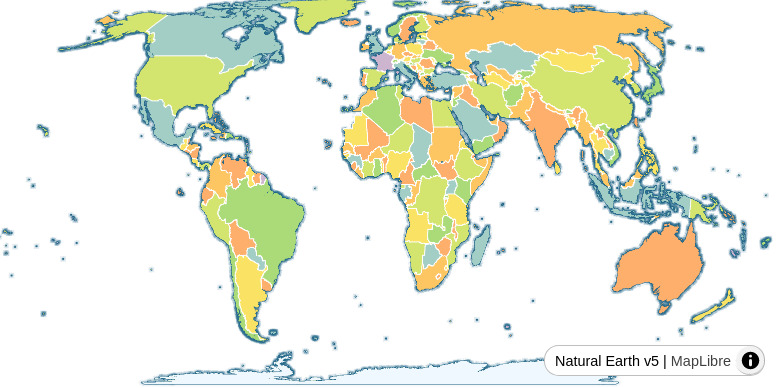

% Farewell Web Mercator
% Pirmin Kalberer @implgeo
% State of the Map Europe 2024 Łódź
---
width: 1600
height: 900
---

# About me

. . .

Lazy mapper (55 changesets in 15 years)

. . .

FOSSGIS e.V. board (German OSM chapter)

. . .

GIS developer

* Sourcepole, Switzerland
* t-rex tile server -> BBOX

# Web Mercator - the bad parts

## Size distortion

Africa actually has 14 times as much area as Greenland

::: notes
Image credit: https://en.wikipedia.org/wiki/Mercator_projection
:::

## Thematic mapping

## In the wild

::: notes
On T-shirts, posters and even in school rooms
:::

# Mercator projection

* Gerardus Mercator, 1596
* Conformal cylindrical map projection
* Good for navigation

::: notes
* north everywhere "up" and south "down", while preserving local directions and shapes
* 1512 (Flanders) - 1594 (Duisburg)
<https://en.wikipedia.org/wiki/Gerardus_Mercator>
:::

## Web Mercator

* Mercator projection cropped to ~85°N to 85°S
  -> square, good for tiling
* Spherical and ellipsoidal mix of formulas

::: notes
The value 85.051129° is the latitude at which the full projected map becomes a square
:::

# Alternatives

##

Theatrum Orbis Terrarum, 1572

::: notes
Cartographer Abraham Ortelius issues Theatrum Orbis Terrarum, the first modern atlas.

Three Latin editions of this (besides a Dutch, a French and a German edition) appeared before the end of 1572; 25 editions came out before Ortelius' death in 1598; and several others were published subsequently, for the atlas continued to be in demand till about 1612. It is often considered as the official beginning of the Golden Age of Netherlandish cartography (~1570s–1670s).
:::

##

::: notes
XKCD
:::

##

::: notes
2018
:::

##

##

# Equal Earth map projection

Bojan Šavrič, Tom Patterson, Bernhard Jenny, 2018

<https://www.equal-earth.com/>

::: notes
Inspired by the Robinson projection, retains the relative size of areas.
:::

## Equal Earth Greenwich

EPSG:8857

## Equal Earth Americas

EPSG:8858

## Equal Earth Asia-Pacific

EPSG:8859

## Equal Earth Florence

Florence Meridian 11E

## Support

* PROJ -> GDAL, QGIS, R
* D3, Plotly
* proj4js

# Web mapping

Equal Earth already in use
by cartographers

. . .

Limitations:

* Limited zooming  
* Static center meridian
* Tile caching

## Tile grid

::: notes
A quadratic grid for Equal Earth centered on Greenwich is similar to a Web Mercator grid.
Instead of Mercator grid corners at +/-20'037'508 the grid corners of Equal Earth 
Greenwich are at +/-17'243'959
:::

## Scaled grid

::: notes
scale factor of 1.162. Conversions between geographic WGS84 coordinates and the map coordinate reference 
system give wrong results without adapted calculations.
But maps can be displayed without any coordinate projection calculations.
:::

## MapLibre

<https://equal.bbox.earth/maplibre/>

Web Mercator grid

## OpenLayers

<https://equal.bbox.earth/ol-asia-pacific/>

Equal Earth Asia-Pacific, Web Mercator grid

## DeckGL

<https://equal.bbox.earth/deckgl/>

MapLibre map with DeckGL layer using Web Mercator tile grid.

## Proposal: Combined projections

<https://equal.bbox.earth/maplibre-eq2merc/>

Equal Earth tiles at z0-z2 and Web Mercator tiles with z >= 3.

## OSM basemap with combined projections

<https://maps.bbox.earth/>

MapLibre with Shortbread PMTiles.

# Possible improvements

## Animated transition z2 -> z3

  <https://kvaleya.gitlab.io/maplibre/globe/globedemo.html>

## Dynamic center meridian

<https://observablehq.com/d/ece4d307c72c1312>

Reproject WGS-84-Tiles?

## Coordinate transformation

Plugins for MapLibre, OpenLayers, etc.
with coordinate transformation functions.

Adapted zoom functions between z < 3 and z >= 3.

# Summary

Say farewell to Web Mercator

(on world scale)

and use Equal Earth instead.

# Thank you

Pirmin Kalberer

<https://mapstodon.space/@implgeo>

[equal.bbox.earth](https://equal.bbox.earth)
